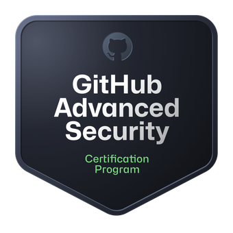
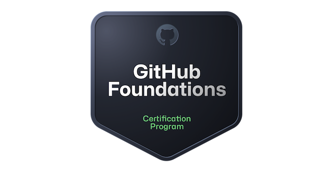

# Hi, I'm Evan Allen

# 🚀 GitHub & DevOps Consultant | GitHub Actions & Advanced Security Expert  

With a strong background in **DevOps, GitHub, and Cloud Engineering**, I specialize in helping organizations **streamline their software development lifecycle** and **migrate to GitHub Enterprise** with ease.  

## 👨‍🏫 Trainer & Enablement Lead  
- Conducted GitHub training for **500+ developers and administrators** on:
  - GitHub Administration  
  - GitHub Actions Fundamentals & Intermediate  
  - GitHub Advanced Security  
  - GitHub Codespaces  
- Designed and implemented best practices for **GitHub Enterprise Cloud and EMU adoption**.  

## 🔄 Migration & CI/CD Optimization  
- Led the migration of **10,000+ repositories** from **Azure DevOps, GitLab, Bitbucket, and SVN** to GitHub.  
- Developed and optimized **CI/CD pipelines** using **GitHub Actions and Azure DevOps** to enhance **automation, security, and release cycles**.  

## 💡 Cloud & DevOps Expertise  
- Managed **Azure environments, Kubernetes clusters, and cloud-native applications**.  
- Reduced cloud costs by **15%** through strategic **optimization of Azure resources**.  

## 🎯 Tech Stack & Focus Areas  
- **GitHub Actions, Advanced Security, Codespaces**  
- **CI/CD, DevOps, Azure, Kubernetes**  
- **.NET, SQL, JavaScript, TypeScript**  
- **Cloud Migrations & Automation**  

💬 Passionate about **helping teams adopt GitHub best practices, secure their code, and build high-performing DevOps workflows**. Let's collaborate! 🚀
