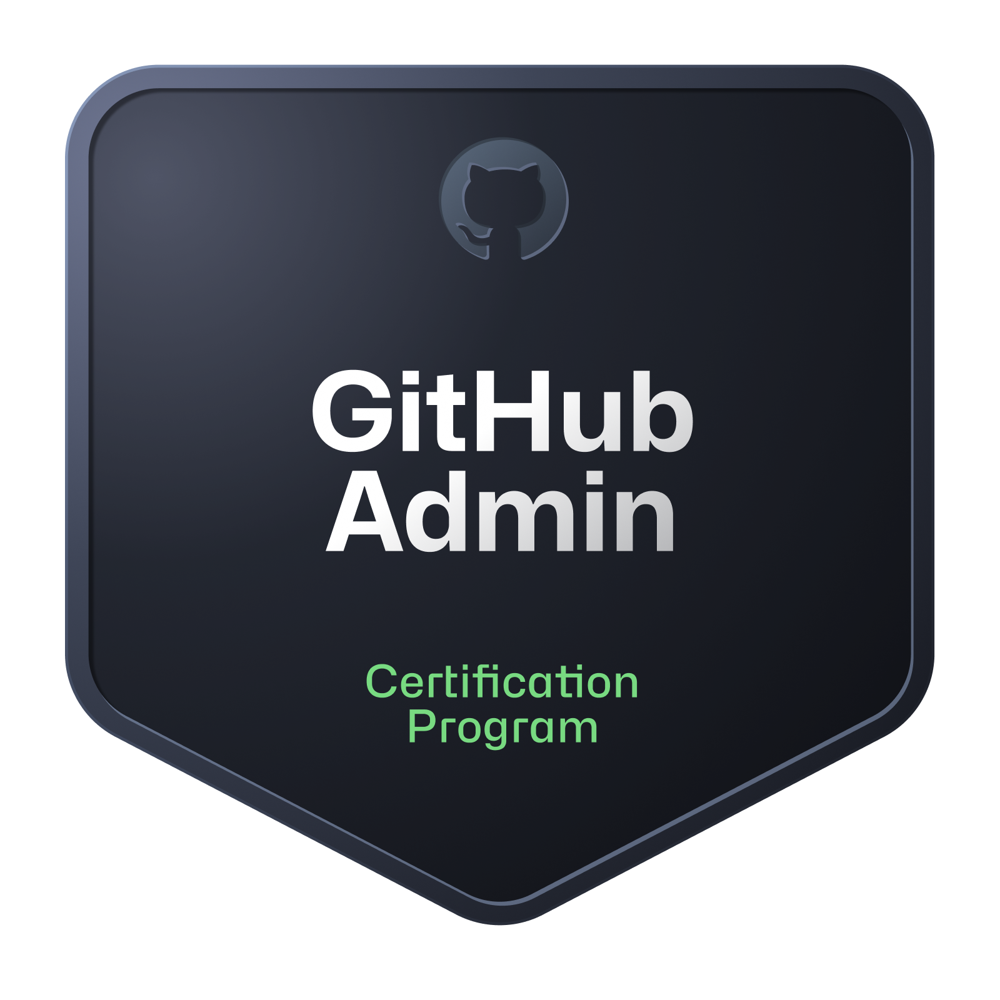

# 👋 Hi, I'm Evan Allen  

---

## 🚀 GitHub & DevOps Consultant | GitHub Actions & Advanced Security Expert  

With a strong background in **DevOps, GitHub, and Cloud Engineering**, I specialize in helping organizations **streamline their software development lifecycle** and **migrate to GitHub Enterprise** with ease.

### 🏆 Certifications  

  
  
  
  
  
  
  
  

---

## 👨‍🏫 Trainer & Enablement Lead  
✔ Delivered **GitHub training** for **500+ developers & administrators** on:  
   - **GitHub Administration**  
   - **GitHub Actions (Fundamentals & Intermediate)**  
   - **GitHub Advanced Security**  
   - **GitHub Codespaces**  

✔ Designed & implemented **best practices** for **GitHub Enterprise Cloud & EMU adoption**.  

---

## 🔄 Migration & CI/CD Optimization  
✔ Led the migration of **10,000+ repositories** from **Azure DevOps, GitLab, Bitbucket, and SVN** to GitHub.  
✔ Developed & optimized **CI/CD pipelines** using **GitHub Actions & Azure DevOps** to enhance **automation, security, and release cycles**.  

---

## ☁️ Cloud & DevOps Expertise  
✔ Managed **Azure environments, Kubernetes clusters, & cloud-native applications**.  
✔ Reduced **cloud costs by 15%** through strategic **Azure resource optimization**.  

---

## 🛠 Tech Stack & Focus Areas  
🚀 **GitHub Actions, Advanced Security, Codespaces**  
⚙️ **CI/CD, DevOps, Azure, Kubernetes**  
💻 **.NET, SQL, JavaScript, TypeScript**  
☁️ **Cloud Migrations & Automation**  

---

💬 Passionate about **helping teams adopt GitHub best practices, secure their code, and build high-performing DevOps workflows**. Let's collaborate! 🚀  
